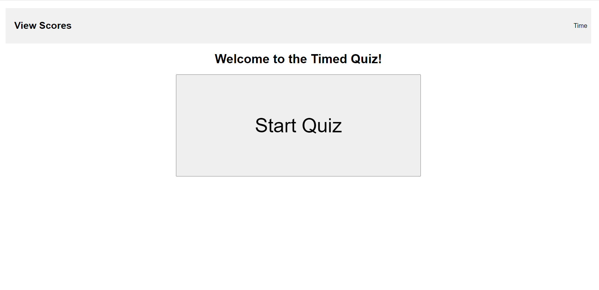

# <JavaScript Quiz>

## Description

This is a small quiz to help improve knowledge and information about javascript. You can change and edit the questions in order to fit your needs and help you study in whatever area you need, including but not limited to JavaScript and coding.

## Installation

https://jojhans.github.io/JSquiz/

## Usage

Click the start quiz button once it loads and the quiz will start! You have 5 minutes to answer, but if you get a question wrong it will reduce your time by 20 seconds. 
    ```md
    
    ```